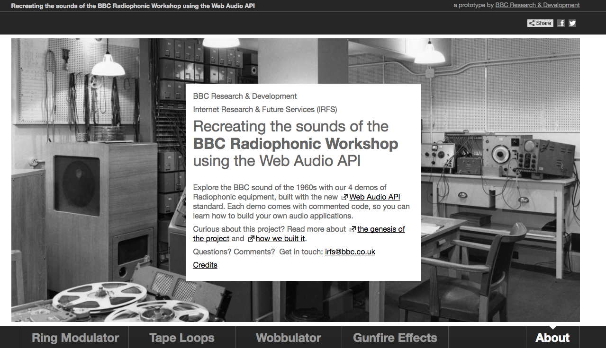
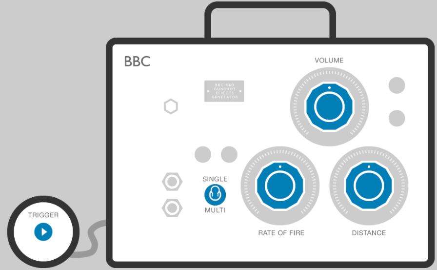
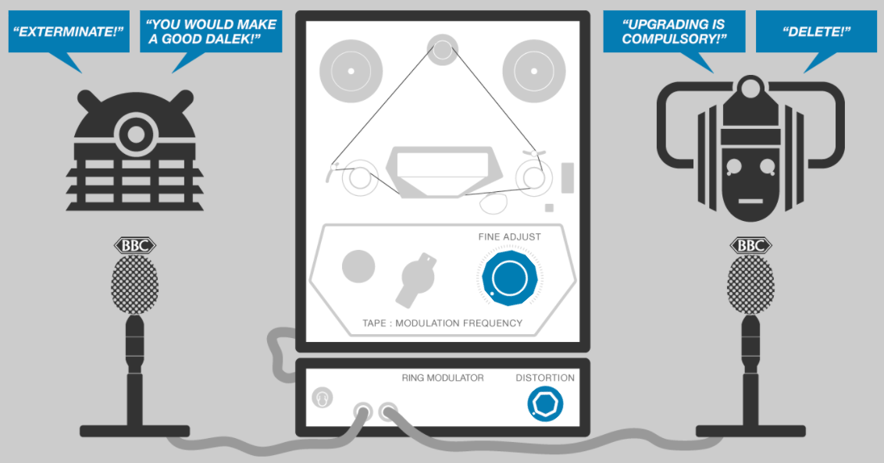
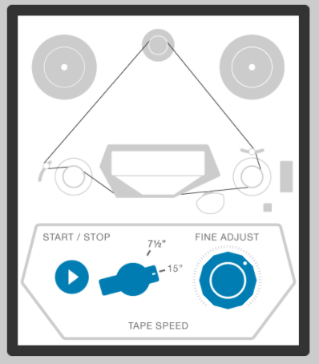
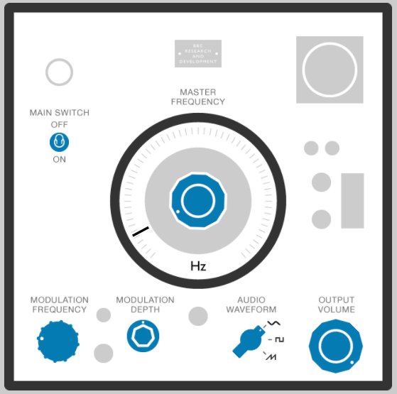

# Radiophonics Workshop Web Audio API Demos 

This repo contains the source code for our project to [recreate the
sound of the Radiophonic Workshop using the Web Audio API](http://webaudio.prototyping.bbc.co.uk/).

The full experience including user interfaces is best viewed on our
site, but this repo provides and easier way to view the source code
of each demo.

## Demos

## Gunfire

- [gunfire.coffee](gunfire.coffee)

---

## Ring Modulator

- [ring-modulator.coffee](ring-modulator.coffee)

---

## Tape Loops

- [tapeloops.coffee](tapeloops.coffee)

---

## Wobbulator

- [wobbulator.coffee](wobbulator.coffee)

# Components

## Knob

- [knob.coffee](knob.coffee)

## Speech Bubble

- [speechbubble.coffee](speechbubble.coffee)

## Switch

- [switch.coffee](switch.coffee)

# License

> Copyright 2016 British Broadcasting Corporation
>
> Licensed under the Apache License, Version 2.0 (the "License");
> you may not use this file except in compliance with the License.
> You may obtain a copy of the License at
>
>     http://www.apache.org/licenses/LICENSE-2.0
>
> Unless required by applicable law or agreed to in writing, software
> distributed under the License is distributed on an "AS IS" BASIS,
> WITHOUT WARRANTIES OR CONDITIONS OF ANY KIND, either express or implied.
> See the License for the specific language governing permissions and
> limitations under the License.
